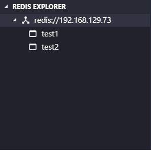
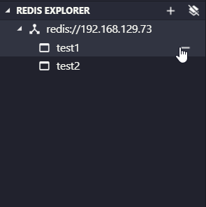

## Note

To easily access to Redis Server from UI.

## Features

1. List up keys on Redis explorer
2. Once you click one of keys, it will open a temporary editable file.
3. As you save the file, it will automatically store it to Redis.
4. Add and delete key from Redis explorer.

## Usage

- Add redis server address. (`Ctrl+Shift+p` or directly edit `easyRedis.address` in settings.json)

- [`Add server`] Once adding redis server address correctly, you will be able to see the list of keys on `REDIS EXPLORER`.

- [`Edit single value`] You can edit `value` that held by `key` on text editor and save it (`ctrl+s`) to store it to Redis.

- [`Edit hash value`] Hash type value MUST be written in `JSON` form.

- [`Delete item`] Click on a key you want to delete and then click `-` icon on `REDIS EXPLORER`.

- [`Add item`] Click on `+` icon, put key string, edit value and save it (`ctrl+s`)!

## Extension Settings

- `easyRedis.address`: add redis server address in url form. (ex: redis://localhost)

## Contribution

Fork the [repo](https://github.com/yellowgg2/easy-redis) and submit pull requests.

**Enjoy!**
